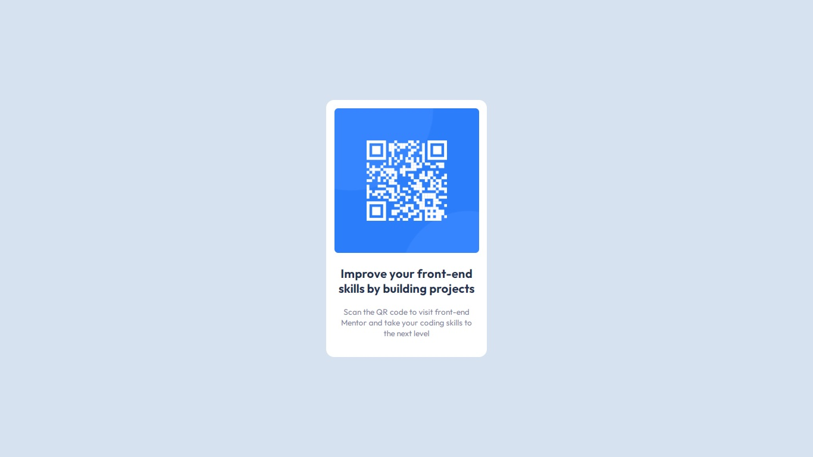

# Frontend Mentor - QR code component solution

This is a solution to the [QR code component challenge on Frontend Mentor](https://www.frontendmentor.io/challenges/qr-code-component-iux_sIO_H). Frontend Mentor challenges help you improve your coding skills by building realistic projects. 

## Table of contents

- [Overview](#overview)
  - [Screenshot](#screenshot)
  - [Links](#links)
- [My process](#my-process)
  - [Built with](#built-with)
  - [What I learned](#what-i-learned)
  - [Continued development](#continued-development)
  - [Useful resources](#useful-resources)
- [Author](#author)
- [Acknowledgments](#acknowledgments)

**Note: Delete this note and update the table of contents based on what sections you keep.**

## Overview

### Screenshot

Screenshot of my version



### Links

- Solution URL: [Add solution URL here](https://your-solution-url.com)
- Live Site URL: [Add live site URL here](https://your-live-site-url.com)

## My process

### Built with

- Semantic HTML5 markup
- CSS custom properties
- CSS Flexbox
- Mobile-first workflow


### What I learned

I learnt how to structure my HTML and CSS codes, in order to achieve a clean code.
This really helped me on how to stake-up HTML elements for easy styling

- See below:

```html
<div class="container">
      <div class="qr-card">
        <div class="qr-code"></div>
        <h2>Improve your front-end skills by building projects</h2>
        <p>Scan the QR code to visit front-end Mentor and take your coding skills to the next level</p>
      </div>
    </div>
```

## Author

- Frontend Mentor - [@Anonymousvigo](https://www.frontendmentor.io/profile/Anonymousvgio)
- Twitter - [@egotanwa](https://x.com/egotanwa)


## Acknowledgments

This goes to me, for being a determined individual
